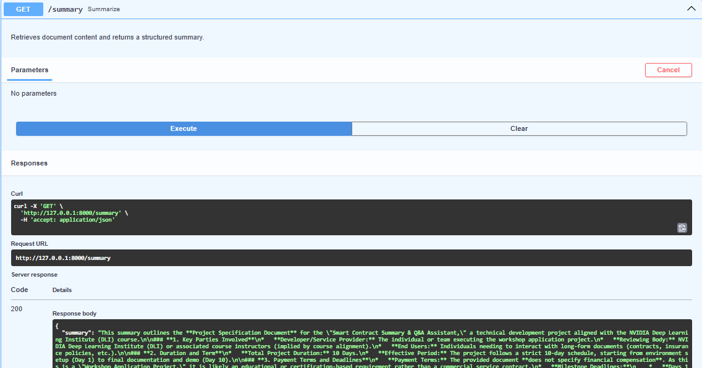
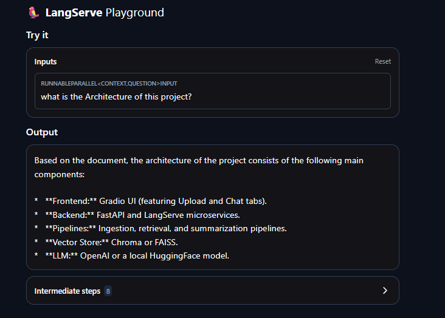
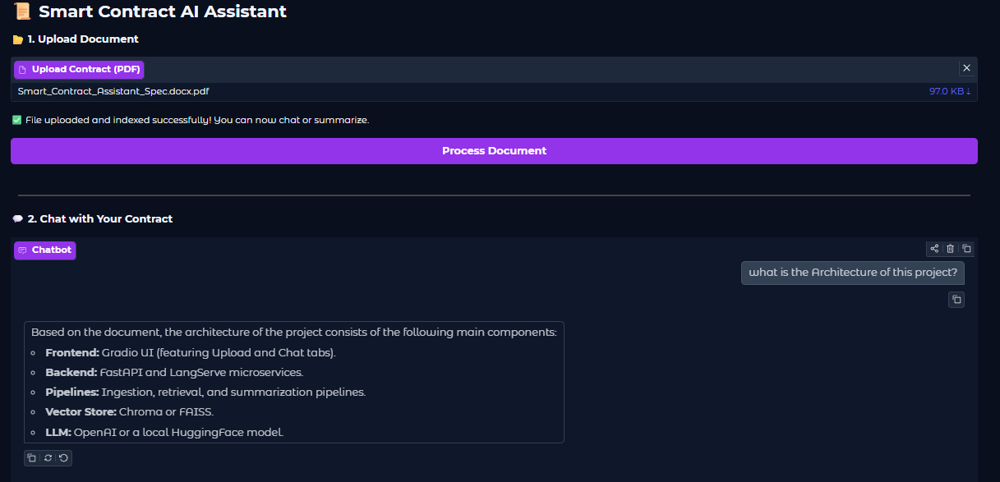

# Smart Contract Summary & Q&A Assistant

AI-powered contract analysis system built using Retrieval-Augmented Generation (RAG) architecture with Google Gemini.

The system allows users to upload contracts (PDF/DOCX), ask semantic questions, and generate structured summaries grounded in the document content.

---

## Overview

This project demonstrates a complete end-to-end LLM pipeline:

- Document ingestion (PDF/DOCX)
- Text chunking and preprocessing
- Embedding generation (Google Embeddings)
- Vector storage using Chroma
- Semantic retrieval (Top-K similarity)
- Answer generation via Gemini (LCEL-based chain)
- API deployment using FastAPI & LangServe
- Interactive interface via Gradio

---

## System Architecture

```
User Upload (PDF/DOCX)
        ↓
Text Extraction
        ↓
Chunking
        ↓
Embeddings (Google)
        ↓
Chroma Vector Store
        ↓
Retriever
        ↓
Gemini LLM (LCEL)
        ↓
Answer / Summary
        ↓
FastAPI + LangServe + Gradio
```

---

## Features

- Upload and process long contracts
- Retrieval-Augmented Question Answering
- Structured contract summarization
- Persistent vector database
- Swagger auto-generated API documentation
- LangServe endpoint exposure
- Modular production-ready architecture

---

## Technology Stack

- FastAPI
- LangChain (LCEL)
- LangServe
- Chroma Vector Database
- Google Gemini API
- Gradio
- Python

---

## Project Structure

```
SMART-CONTRACT-ASSISTANT/
│
├── app/
│   ├── api/
│   │   └── routes.py
│   │
│   ├── core/
│   │   └── config.py
│   │
│   ├── ingestion/
│   │   ├── loader.py
│   │   ├── chunker.py
│   │   └── vectorstore.py
│   │
│   ├── retrieval/
│   │   ├── rag_chain.py
│   │   └── summary_chain.py
│   │
│   ├
│   │
│   └── main.py
│
├── uploaded_docs/
├── vectorstore/
├── gradio_app.py
├── requirements.txt
└── .env


```

---

## Installation

### 1. Create Virtual Environment

```bash
python -m venv venv
venv\Scripts\activate
```

### 2. Install Dependencies

```bash
pip install -r requirements.txt
```

### 3. Configure Environment Variables

Create a `.env` file:

```
GOOGLE_API_KEY=your_google_api_key
```

---

## Run the Application

```bash
uvicorn app.main:app --reload
```

Swagger Documentation:

```
http://127.0.0.1:8000/docs
```

---

## API Endpoints

- `POST /upload` → Upload and process document
- `/rag` → Question answering endpoint (LangServe)
- `GET /summary` → Generate structured contract summary

---

## Screenshots

### FastAPI / Swagger



### LangServe Endpoint



### Gradio Interface



---

## Design Highlights

- LCEL composable chain architecture
- Context-grounded answer generation
- Modular ingestion and retrieval layers
- Persistent vector storage
- Scalable and extensible backend design

---

## Future Improvements

- Multi-document retrieval
- Conversation memory
- Advanced guardrails
- Docker deployment
- Cloud hosting
